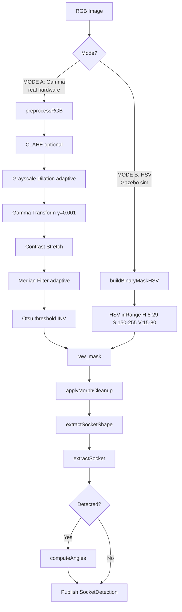
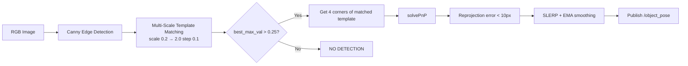
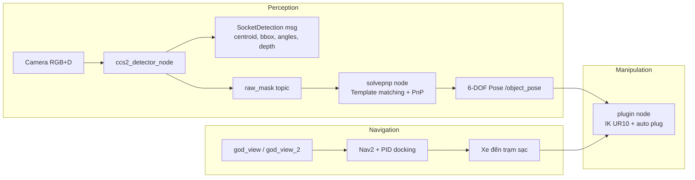

# CCS2 Socket Detection Pipeline — Ghi chú

> Dự án robot sạc xe điện tự động: phát hiện cổng sạc CCS2 bằng camera 3D depth, tính pose 6-DOF, điều khiển tay UR10 cắm sạc.

---

## Mục lục

1. [Các Package Liên Quan](#1-các-package-liên-quan)
2. [Message Definition](#2-message-definition)
3. [Pipeline Chính — ccs2_detector_node](#3-pipeline-chính--ccs2_detector_node)
4. [Depth Heatmap Node](#4-depth-heatmap-node)
5. [SolvePnP Node](#5-solvepnp-node)
6. [Plugin Node (IK + Auto Plug)](#6-plugin-node-ik--auto-plug)
7. [Auto Docking](#7-auto-docking)
8. [Simulation Setup](#8-simulation-setup)
9. [Luồng Hoạt Động Hoàn Chỉnh](#9-luồng-hoạt-động-hoàn-chỉnh)
10. [Các Kỹ Thuật AI/CV Được Dùng](#10-các-kỹ-thuật-aicv-được-dùng)

---

## 1. Các Package Liên Quan

| Package | Đường dẫn | Vai trò |
|---------|-----------|---------|
| `ccs2_socket_detector` | `ccs2_socket_detector/` | Định nghĩa message ROS2 cho kết quả detect |
| `my_ur_control_cpp` | `my_ur_control_cpp/` | Chứa toàn bộ node C++ xử lý vision & điều khiển |
| `thanxe_new_description` | `thietkemoi/thanxe_new_description/` | Mô tả URDF xe + camera + trạm sạc |

---

## 2. Message Definition

**File:** `ccs2_socket_detector/msg/SocketDetection.msg`

```cpp
std_msgs/Header header
bool detected           // trạng thái phát hiện
float32 centroid_x/y    // tâm cổng sạc trong ảnh (pixel)
float32 bbox_x/y/width/height  // bounding box
float32 angle_xy        // góc xoay trong mặt phẳng ảnh (ellipse fit)
float32 angle_yz        // góc nghiêng dọc (pitch) — dùng depth + chiều cao socket
float32 angle_xz        // góc nghiêng ngang (yaw) — dùng depth + chiều rộng socket
float32 depth_m         // khoảng cách trung bình từ camera đến socket (mét)
```

---

## 3. Pipeline Chính — ccs2_detector_node

**File:** `my_ur_control_cpp/src/ccs2_detector_node.cpp`  
**Header:** `my_ur_control_cpp/include/ccs2_socket_detector/ccs2_detector_node.hpp`

### Input Topics
- `/base_camera/base_camera_sensor/image_raw` — RGB image (1280×720)
- `/base_camera/base_camera_sensor/depth/image_raw` — Depth map (32FC1 mét)

### Output Topics
- `~/socket_detection` — SocketDetection msg
- `~/debug_image` — Ảnh debug có overlay
- `~/mask_image` — Mask sau xử lý
- `~/raw_mask` — Mask nhị phân thô (dùng cho solvepnp)

### Flow xử lý (sync callback)



### Chi tiết các bước

#### a) MODE A — Gamma pipeline (hardware thật)

**Hàm `preprocessRGB()`** (line 245):
1. **CLAHE** (tùy chọn) — Contrast Limited Adaptive Histogram Equalization, tăng local contrast ở vùng tối
2. **Grayscale Dilation** — kernel hình đĩa, adaptive scale theo depth
3. **Gamma transform** (γ=0.001) — làm tối vùng đen, sáng vùng trắng
4. **Contrast stretch** — dãn histogram
5. **Median filter** — kernel size adaptive theo depth

**Hàm `buildBinaryMaskGamma()`** (line 301):
- Threshold Otsu nghịch đảo → vùng socket (tối) thành trắng

#### b) MODE B — HSV pipeline (Gazebo/simulation)

**Hàm `buildBinaryMaskHSV()`** (line 312):
- Lọc màu cam/đỏ của socket CCS2 trong không gian HSV
- Default: H(8-29), S(150-255), V(15-80)

#### c) Adaptive Morphology — CẢI TIẾN QUAN TRỌNG

**Hàm `depthScale()`** (line 133):
```cpp
scale = clamp(ref_depth / last_depth, min_scale, 1.0)
```
- `ref_depth_m` = 0.5m (khoảng cách chuẩn, scale=1.0)
- `min_scale` = 0.20 (scale tối thiểu)
- Khi socket ở xa → scale nhỏ → kernel morphology nhỏ hơn
- Dùng **EMA** (exponential moving average) để lọc nhiễu depth:
  ```cpp
  last_depth_ = 0.8 * last_depth_ + 0.2 * det.depth_m;
  ```

**Hàm `applyMorphCleanup()`** (line 334):
1. Dilate với kernel cross (2 iterations)
2. Close với kernel disk (2 iterations)
3. Hole fill: flood background → invert → OR back
4. Open với kernel disk (2 iterations)
5. Close với kernel disk (2 iterations)

#### d) Extract Socket Shape

**Hàm `extractSocketShape()`** (line 374):
- `bitwise_and(binary_mask, binarized_median)` → logical mult (theo paper)
- Dilate + Close + Open + Erode (adaptive kernel)

#### e) Extract Socket — Chọn contour tốt nhất

**Hàm `extractSocket()`** (line 416):

1. `findContours` với `RETR_EXTERNAL`
2. **Adaptive min_area**: `eff_min_area = max(50, min_area × scale²)`
3. **Aspect-ratio filter**: CCS2 H/W ≈ 1.5, bounds [0.55, 2.80]
4. **Soft scoring**: 
   ```cpp
   diff = (ratio - expected_ratio) / 0.5
   ascore = exp(-0.5 × diff²)
   score = area × ascore
   ```
5. Tính centroid từ moments
6. Góc từ `fitEllipse` (≥5 points) hoặc `minAreaRect`
7. **Depth extraction**: median depth từ vùng socket mask (robust với NaN)

#### f) Compute Angles — Tính góc nghiêng

**Hàm `computeAngles()`** (line 543):

- **φ_YZ** (pitch): So sánh depth trung bình 10% hàng trên vs 10% hàng dưới
  ```cpp
  angle_yz = asin((depth_top - depth_bottom) / socket_height)
  ```
- **φ_XZ** (yaw): So sánh depth trung bình 10% cột trái vs 10% cột phải
  ```cpp
  angle_xz = asin((depth_left - depth_right) / socket_width)
  ```

### Parameters

| Parameter | Default | Mô tả |
|-----------|---------|-------|
| `use_color_filter` | false | true = HSV (Gazebo), false = Gamma (real) |
| `gamma` | 0.001 | Gamma transform value |
| `median_ksize` | 9 | Median filter kernel size |
| `morph_radius` | 12 | Morphological SE radius |
| `use_clahe` | false | Bật CLAHE pre-enhancement |
| `clahe_clip` | 2.0 | CLAHE clip limit |
| `clahe_grid` | 8 | CLAHE grid size |
| `hsv_h_low/high` | 8/29 | HSV Hue range |
| `hsv_s_low/high` | 150/255 | HSV Saturation range |
| `hsv_v_low/high` | 15/80 | HSV Value range |
| `socket_h_mm` | 135.0 | Chiều cao socket (mm) |
| `socket_w_mm` | 90.0 | Chiều rộng socket (mm) |
| `min_area` | 500.0 | Min contour area (px²) |
| `adaptive_morph` | true | Bật adaptive morphology |
| `ref_depth_m` | 0.5 | Khoảng cách chuẩn cho full-size SE |
| `min_scale` | 0.20 | Scale tối thiểu |
| `use_aspect_filter` | true | Bật aspect-ratio filter |
| `aspect_ratio_min` | 0.55 | Aspect ratio min |
| `aspect_ratio_max` | 2.80 | Aspect ratio max |

---

## 4. Depth Heatmap Node

**File:** `my_ur_control_cpp/src/depth_heatmap.cpp`

Node đơn giản để visualize depth:

1. Subscribe `/base_camera/base_camera_sensor/depth/image_raw`
2. Convert sang 32FC1, patch NaN → 0
3. Normalize về [0, 1] dùng min/max từ valid pixels
4. Áp dụng colormap **JET** (gần = đỏ, xa = xanh)
5. Set pixel không hợp lệ (depth ≤ 0) thành đen
6. Publish `/base_camera/depth_heatmap`

---

## 5. SolvePnP Node

**File:** `my_ur_control_cpp/src/solvepnp.cpp`

> **Lưu ý**: Code hiện tại dùng **multi-scale template matching** trên edge image, không phải circle detection như README cũ.

### Flow



### Chi tiết

**Camera matrix:**
```cpp
fx = 1280 / (2 * tan(60° / 2))  // từ FOV 60°
K = [[fx, 0, 640],
     [0, fx, 360],
     [0, 0,  1]]
dist = zeros(4,1)
```

**Object points (4 góc socket, mét):**
```cpp
obj_pts = {
    (-0.045,  0.05875, 0),   // TL
    ( 0.045,  0.05875, 0),   // TR
    ( 0.045, -0.05875, 0),   // BR
    (-0.045, -0.05875, 0)    // BL
}
```

**Template:** file `congsac2.png` — ảnh mẫu socket

**SolvePnP:**
- First frame: `SOLVEPNP_IPPE_SQUARE` (không dùng extrinsic guess)
- Subsequent frames: `SOLVEPNP_ITERATIVE` (dùng extrinsic guess từ frame trước)

**Smoothing:**
- Rotation: **SLERP** với alpha = 0.3
- Translation: **EMA** `tvec_smooth = 0.3 × tvec_smooth + 0.7 × tvec`
- Jump detection: nếu `||tvec - tvec_smooth|| > 0.15m` → reset smooth

### Topics

| Topic | Type | Direction |
|-------|------|-----------|
| `/base_camera/base_camera_sensor/image_raw` | `sensor_msgs/Image` | sub |
| `/object_pose` | `geometry_msgs/PoseStamped` | pub |
| `/pnp_debug/image` | `sensor_msgs/Image` | pub |
| `/pnp_debug/mask` | `sensor_msgs/Image` | pub |
| `/pnp/tvec` | `geometry_msgs/Vector3` | pub |
| `/pnp/rvec` | `geometry_msgs/Vector3` | pub |

---

## 6. Plugin Node (IK + Auto Plug)

**File:** `my_ur_control_cpp/src/plugin.cpp`

Node điều khiển tay robot UR10 cắm sạc.

### Thông số cố định

```cpp
FIXED_Z     = -0.18     // độ cao cố định khi cắm
FIXED_ROLL  = π         // hướng cố định
FIXED_PITCH = 0
FIXED_YAW   = 3π/2
OFFSET_X    = 0.0025    // offset tinh chỉnh
OFFSET_Y    = -0.03
OFFSET_Z    = -0.01
DRIVE_VX    = 0.3       // vận tốc tịnh tiến
DRIVE_MS    = 1500      // thời gian tịnh tiến (ms)
```

### DH Parameters (UR10)

```cpp
d1 = 0.1273, a2 = -0.612, a3 = -0.5723
d4 = 0.1639, d5 = 0.1157, d6 = 0.0922
```

### Flow

1. Subscribe `/circle_detector/socket_pose` → lấy tọa độ Y của socket
2. **Inverse kinematics** tự code (giải tích 8 nghiệm)
3. **Select best solution**: ưu tiên nghiệm có tổng góc (joint 1+2+3) gần -270°
4. Gửi joint trajectory đến `/joint_trajectory_controller/joint_trajectory`

### Sequence khi gõ "ok":
1. IK với X=0.8m, Y từ socket pose
2. Tịnh tiến xe 1.5s (linear.x = 0.3)
3. IK với X=1.0m (tiến sâu hơn)

---

## 7. Auto Docking

### C++ Version — god_view_2.cpp

**File:** `my_ur_control_cpp/src/god_view_2.cpp`

- Gọi Nav2 action server `navigate_to_pose`
- 3 trạm sạc với tọa độ hardcoded:
  - Trạm 1: (-8.0, 0.0, yaw=1.57)
  - Trạm 2: (-8.0, -4.0, yaw=1.57)
  - Trạm 3: (0.0, -8.0, yaw=3.14)
- Nhập số trạm từ terminal

### Python Version — god_view.py

**File:** `thietkemoi/thanxe_new_description/thanxe_new_description/god_view.py`

2 giai đoạn:
1. **Nav2 transit**: Đi đến approach point (cách dock 1.5m)
2. **PID docking**: Dùng swerve drive để trượt ngang vào chuồng sạc

PID details:
- Bước 0: Xoay cho đúng hướng (angular.z)
- Bước 1: PID riêng cho X và Y (local frame)
  - X: tiến/lùi dọc tường
  - Y: trượt ngang (ưu tiên chính để đâm sạc)
- Acceleration ramping (max 0.015)
- Điều kiện dừng: cả X và Y < 5mm

---

## 8. Simulation Setup

**File:** `thietkemoi/thanxe_new_description/launch/complete.launch.py`

### Khởi động:
1. Gazebo với world file
2. Robot state publisher (từ `complete_visual.xacro`)
3. Controllers: joint_state_broadcaster, steering_controller, drive_controller, joint_trajectory_controller
4. Swerve drive node
5. Depth heatmap node (đang comment)
6. SolvePnP node (đang comment)
7. 3 trạm sạc (đang comment)

### Camera

**File:** `thietkemoi/thanxe_new_description/urdf/camera.xacro`

```xml
Horizontal FOV: 0.8 rad
Resolution: 1280 × 720
Format: R8G8B8
Clip near/far: tùy chỉnh
Type: depth camera (Gazebo)
Plugin: libgazebo_ros_camera.so
```

### Trạm sạc

**File:** `models/tram_sac_VF/model.sdf`

3 trạm tại tọa độ:
- Trạm 1: (10.5, 0.2, Y=-1.57)
- Trạm 2: (10.5, 4.0, Y=-1.57)
- Trạm 3: (0.0, 10.5, Y=0.0)

---

## 9. Luồng Hoạt Động Hoàn Chỉnh



### Sequence hoàn chỉnh:
1. Người dùng nhập số trạm sạc (1, 2, 3)
2. Xe tự hành đi đến approach point (Nav2)
3. PID docking: xe trượt ngang vào đúng vị trí
4. Camera RGB+D phát hiện cổng sạc CCS2
5. ccs2_detector_node tính centroid, bbox, depth, góc nghiêng
6. solvepnp node tính pose 6-DOF từ template matching + PnP
7. plugin node nhận pose, tính IK, điều khiển tay UR10 cắm sạc

---

## 10. Các Kỹ Thuật AI/CV Được Dùng

| # | Kỹ thuật | Ứng dụng | File |
|---|----------|----------|------|
| 1 | **Gamma transform** | Tiền xử lý ảnh thiếu sáng | `ccs2_detector_node.cpp` |
| 2 | **CLAHE** | Tăng local contrast vùng tối | `ccs2_detector_node.cpp` |
| 3 | **Adaptive morphology** | Kernel tự động điều chỉnh theo depth | `ccs2_detector_node.cpp` |
| 4 | **Otsu threshold** | Phân ngưỡng tự động | `ccs2_detector_node.cpp` |
| 5 | **HSV color filter** | Lọc màu socket trong simulation | `ccs2_detector_node.cpp` |
| 6 | **Contour analysis** | Tìm và lọc contour theo area + shape | `ccs2_detector_node.cpp` |
| 7 | **Soft scoring** | Score contour theo area × aspect ratio | `ccs2_detector_node.cpp` |
| 8 | **Depth-based angle estimation** | Tính góc nghiêng từ depth map | `ccs2_detector_node.cpp` |
| 9 | **Multi-scale template matching** | Nhận dạng socket ở nhiều tỉ lệ | `solvepnp.cpp` |
| 10 | **SolvePnP (IPPE/ITERATIVE)** | Ước lượng pose 6-DOF | `solvepnp.cpp` |
| 11 | **SLERP smoothing** | Làm mượt rotation real-time | `solvepnp.cpp` |
| 12 | **EMA smoothing** | Làm mượt translation real-time | `solvepnp.cpp` |
| 13 | **Inverse kinematics (giải tích)** | Tính joint angles cho UR10 | `plugin.cpp` |
| 14 | **PID control** | Điều khiển docking chính xác | `god_view.py` |
| 15 | **Colormap JET** | Visualize depth heatmap | `depth_heatmap.cpp` |
